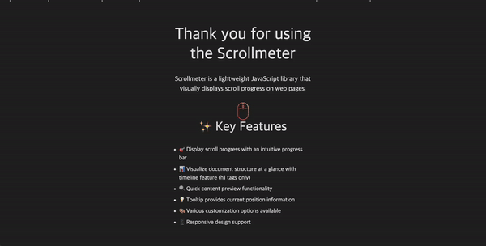

# Scrollmeter


Scrollmeter는 웹 페이지의 스크롤 진행률을 시각적으로 표시해주는 가벼운 JavaScript 라이브러리입니다.



## ✨ 주요 기능

- 🎯 직관적인 프로그레스 바로 스크롤 진행 상황 표시
- 📊 타임라인 기능으로 문서 구조를 한눈에 파악 (h1 태그만 해당)
- 🔍 빠른 콘텐츠 미리보기 기능
- 💡 현재 위치 정보를 제공하는 툴팁
- 🎨 다양한 커스터마이징 옵션
- 📱 반응형 디자인 지원

## 🚀 설치하기

```
npm install @scrollmeter/core
```

or

```
yarn add @scrollmeter/core
```

## 🔧 사용방법

스크롤 진행 상황을 표시하고 싶은 컨테이너 요소에 ID를 지정하고, createScrollmeter 함수를 호출하여 해당 ID를 targetId 옵션으로 전달합니다.

### Javascript

일반 JavaScript 환경에서는 DOM이 완전히 로드된 후에 createScrollmeter 함수를 호출해야 합니다.

```
import { createScrollmeter } from '@scrollmeter/core';
import '@scrollmeter/core/dist/index.css';

window.onload = function() {
  createScrollmeter({
    targetId: "container_id_to_measure",
    useTimeline: true,
    useTooltip: true,
    usePreview: true,
  });
}
```

### React

React 환경에서는 useEffect 훅을 사용하여 컴포넌트가 마운트될 때 createScrollmeter 함수를 호출하면 됩니다.

```
import { useEffect } from 'react';
import { createScrollmeter } from '@scrollmeter/core';
import '@scrollmeter/core/dist/index.css';

function App() {
  const [scrollOptions, setScrollOptions] = useState({
    targetId: 'container_id_to_measure',
    useTimeline: true,
    useTooltip: true,
    usePreview: true,
  });

  useEffect(() => {
    createScrollmeter(scrollOptions);
  }, []);

  return (
    <div id="container_id_to_measure">
      {/* 스크롤을 측정하고 싶은 콘텐츠 */}
    </div>
  );
}
```

## ⚙️ 설정 옵션

- **useTimeline**: 문서 구조를 보여주는 타임라인 기능 활성화/비활성화
- **useTooltip**: 현재 스크롤 위치를 보여주는 툴팁 표시 여부
- **usePreview**: 콘텐츠 미리보기 기능 활성화/비활성화
    - ⚠️ 미리보기 기능은 useTooltip이 true로 설정되어 있어야 합니다
    - ⚠️ CORS 제한으로 인해 외부 이미지는 미리보기에 포함되지 않습니다

## 🎨 스타일 커스터마이징

### javascript

```
import { createScrollmeter } from '@scrollmeter/core';
import '@scrollmeter/core/dist/index.css';

window.onload = function() {
    let scrollOptions = {
        targetId: "container_id_to_measure",
        useTimeline: true,
        useTooltip: true,
        usePreview: true,
    }

    const scrollmeter = createScrollmeter(scrollOptions);

    scrollOptions = {
        ...scrollOptions,
        barOptions: {
            color: '#4A90E2',
            height: 10,
            background: 'rgba(0, 0, 0, 0)',
        },
    }

    scrollmeter.updateScrollmeterStyle(scrollOptions);
}
```

### React

```
import { useEffect } from 'react';
import { createScrollmeter } from '@scrollmeter/core';
import '@scrollmeter/core/dist/index.css';

function App() {
    const scrollmeter = useRef<ReturnType<typeof createScrollmeter> | null>(null);
    const [scrollOptions, setScrollOptions] = useState<ScrollmeterOptions>({
        targetId: 'container_id_to_measure',
        useTimeline: true,
        useTooltip: true,
        usePreview: true,
    });

    useEffect(() => {
        if (scrollmeter.current) return;
        scrollmeter.current = createScrollmeter(scrollOptions);
    }, []);

    useEffect(() => {
        if (scrollmeter.current) {
            scrollmeter.current.updateScrollmeterStyle(scrollOptions);
        }
    }, [scrollOptions]);

    return (
        <div id="container_id_to_measure">
            {/* Content you want to measure scroll for */}
        </div>
    );
}
```

### barOptions

| 속성       | 타입   | 설명                 | 기본값                  |
| ---------- | ------ | -------------------- | ----------------------- |
| color      | string | 프로그레스 바 색상   | rgba(74, 144, 226, 0.9) |
| height     | number | 프로그레스 바 높이   | 10                      |
| background | string | 프로그레스 바 배경색 | rgba(0, 0, 0, 0)        |

### timelineOptions

| 속성  | 타입   | 설명          | 기본값  |
| ----- | ------ | ------------- | ------- |
| color | string | 타임라인 색상 | #838383 |
| width | number | 타임라인 너비 | 4       |

### tooltipOptions

| 속성          | 타입   | 설명           | 기본값 |
| ------------- | ------ | -------------- | ------ |
| background    | string | 툴팁 배경색    | #333   |
| fontColor     | string | 툴팁 글자색    | white  |
| fontSize      | number | 툴팁 글자 크기 | 12     |
| paddingInline | number | 툴팁 가로 패딩 | 8      |
| paddingBlock  | number | 툴팁 세로 패딩 | 6      |
| width         | number | 툴팁 너비      | 150    |

## 🌟 데모

[Demo](https://freechird2.github.io/scrollmeter)

## 📝 라이선스

MIT License

Copyright (c) 2024 freechird2
